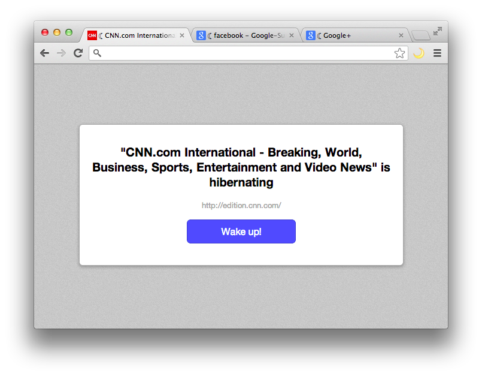

## TabHibernate

TabHibernate will be a Chrome Extension that will send inactive Tabs into some kind of "Hibernate" mode – Mostly like [OneTab](https://chrome.google.com/webstore/detail/onetab/chphlpgkkbolifaimnlloiipkdnihall) but without removing the tabs from the tabbar.

You may download the extension for your browser in the [Chrome Web Store](https://chrome.google.com/webstore/detail/tab-hibernation/pbdpajcdgknpendpmecafmopknefafha/).

## Screenshot

