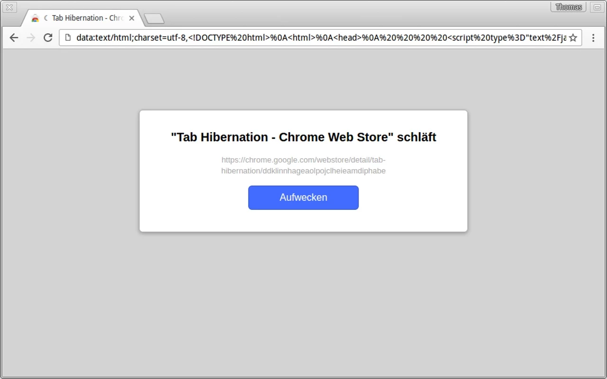

# TabHibernate
TabHibernate is a Browser Extension that will send inactive Tabs into some kind of "Hibernate" mode – Mostly like [OneTab](https://chrome.google.com/webstore/detail/onetab/chphlpgkkbolifaimnlloiipkdnihall) but without removing the tabs from the tabbar.

You may download the extension in the [Chrome Web Store](https://chrome.google.com/webstore/detail/tab-hibernation/ddklinnhageaolpojclheieamdiphabe).

**Currently only the Chrome-Version is really supported.
Safari-Version needs a maintainer and a Firefox-Version would be nice to have, contact [@HorayNarea](https://github.com/HorayNarea) if you want to do something about that.**

## Building the extension
Code (or other files) that can be used by both the Chrome and Safari extension are stored in `lib/`. Browser-specific code is stored in `Chrome/` for Chrome and in `TabHibernation.safariextension/` for Safari.

To make the files in `lib/` accessible from both extensions hard links need to be created. Just run `make` to create these links.

## Screenshot

